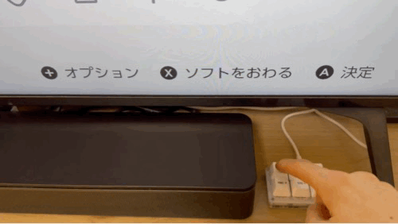
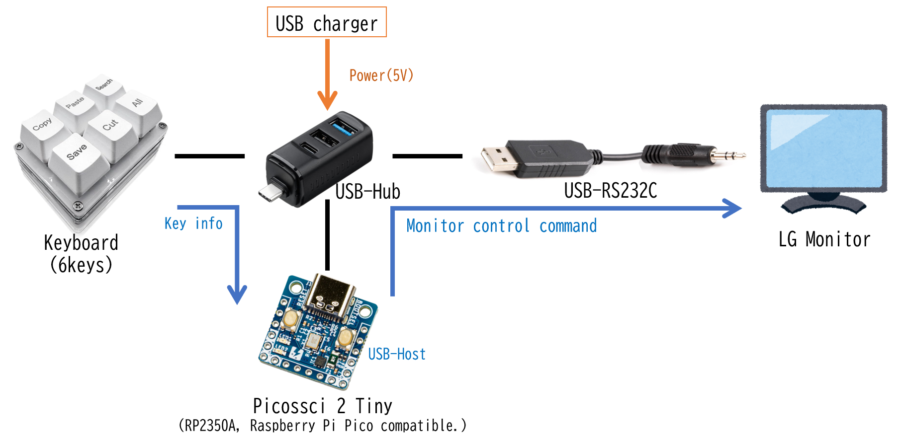

# LG 43UN700 RS232C Controller (RP2350A Firmware)

[日本語版はこちら](#lg-43un700-rs232c-controller-rp2350a-firmware-日本語)

Firmware for RP2350A that controls LG 43UN700 series monitors via RS232C using a USB keyboard.
Each key on a 6-key keyboard is mapped to power ON/input switching or power OFF, allowing one-key operation.
See the build article [here](https://zenn.dev/pphouse2789/articles/lg-monitor-ctrl) (Japanese).



## Hardware

| Component | Model / Purchase |
|-----------|-----------------|
| Microcontroller | [Picossci 2 Tiny (RP2350A)](https://www.switch-science.com/products/9797) |
| Keyboard | [6-key keyboard](https://www.amazon.co.jp/dp/B0FN3HRL25) |
| USB-RS232C adapter | [USB-RS232C cable](https://www.amazon.co.jp/dp/B075VKZ84S) *TX and RX wires must be swapped |
| USB Hub | [Sanwa 400-HUBCP38BK (Type-C power delivery)](https://www.amazon.co.jp/dp/B0G2VHL17K) |

A USB hub with power delivery support is required to connect both the keyboard and USB-RS232C adapter, and to power the Picossci 2 Tiny simultaneously.



## Software

The RP2350A operates as a USB host using TinyUSB. It receives HID reports from the keyboard, detects key presses, and sends the corresponding RS232C commands via FTDI.

### Key Mapping

| Key | Action | Commands Sent |
|-----|--------|---------------|
| Copy   | Power ON + HDMI1 | `ka 00 01\r` → wait OK → `xb 00 90\r` |
| Paste  | Power ON + HDMI2 | `ka 00 01\r` → wait OK → `xb 00 91\r` |
| Search | Power ON + HDMI3 | `ka 00 01\r` → wait OK → `xb 00 92\r` |
| Save   | Power ON + HDMI4 | `ka 00 01\r` → wait OK → `xb 00 93\r` |
| Cut    | Power ON + Type-C | `ka 00 01\r` → wait OK → `xb 00 E0\r` |
| All    | Power OFF | `ka 00 00\r` → wait OK → `ka 00 00\r` |

- Each command is terminated with CR (`\r`)
- The second command is sent only after an `OK` response is received from the monitor
- If `OK` is not received, LED2 blinks and the second command is not sent

### Debug LED Behavior

| Timing | LED Action |
|--------|-----------|
| On startup | LED1 (green) flashes 3 times rapidly |
| USB keyboard connected | LED1 (green) flashes once |
| USB-RS232C adapter connected | LED2 (red) flashes once |
| Key press detected | LED1 + LED2 flash simultaneously once (short) |
| All commands OK | LED1 (green) flashes once |
| NG or timeout | LED2 (red) flashes once |

### Debug Output (UART)

Connect a USB-UART adapter to GPIO0 (TX) / GPIO1 (RX) to view debug logs via a terminal application at 115200 baud. (Not verified)

## Build

### Prerequisites

- [Pico SDK 2.0+](https://github.com/raspberrypi/pico-sdk)
- CMake 3.13+
- ARM GCC toolchain (arm-none-eabi-gcc)

### Steps

```bash
export PICO_SDK_PATH=/path/to/pico-sdk
mkdir build && cd build
cmake -DPICO_BOARD=pico2 ..
make -j$(nproc)
```

### Flashing

1. Hold the **BOOTSEL button** on Picossci 2 Tiny and connect via USB
2. A `RP2350` drive will appear
3. Copy `picossci2_kbd_uart.uf2` to the drive
4. The board will reboot automatically and start running the firmware

## Troubleshooting

| Symptom | Solution |
|---------|---------|
| USB devices not recognized | Check Type-C power delivery from the Hub |
| Keyboard not responding | Check mount log via debug UART |
| RS232C adapter not recognized | Check `CFG_TUH_CDC_FTDI` in `tusb_config.h` |
| Response timeout | Check TX/RX swap, verify baud rate setting |
| LED not lighting | Check LED pin numbers (LED1=GP25, LED2=GP24) |

---
# LG 43UN700 RS232C Controller (RP2350A Firmware)
LG電子の43UN700シリーズモニターに対して、USB キーボードから RS232C 経由で操作するRP2350A用のファームウェアです。
6キーキーボードの各キーに電源ON/入力切替・電源OFFを割り当て、ワンキーで操作できます。製作記事は[こちら](https://zenn.dev/pphouse2789/articles/lg-monitor-ctrl)


## 使用ハードウェア

| 機器 | 型番・購入先 |
|------|-------------|
| マイコンボード | [Picossci 2 Tiny (RP2350A)](https://www.switch-science.com/products/9797) |
| キーボード | [6キーキーボード](https://www.amazon.co.jp/dp/B0FN3HRL25) |
| USB-RS232C 変換 | [USB-RS232C 変換ケーブル](https://www.amazon.co.jp/dp/B075VKZ84S) *ケーブルをカットして TX と RX を入れ替える必要あり|
| USB Hub | [サンワサプライ 400-HUBCP38BK（Type-C 給電対応）](https://www.amazon.co.jp/dp/B0G2VHL17K) |


## ハードウェア

USBキーボードとUSB-RS232CをRP2350A搭載基板に接続します。USBポート増設と電源供給を目的として、USB給電に対応しているUSB-Hubを使用します。


## ソフトウェア
### 動作概要
TinyUSBをつかってRP2350AをUSBホストとして動作させます。USBキーボードとUSB-RS232Cを使って、キーボードからキー情報を取得し、対応するRS232Cコマンドを投げます。動作は以下の流れとなります。

- USB Hubに接続されたキーボードからHIDレポートを受信
- キーの種類を検出
- 対応するRS232CコマンドをFTDI経由で送信
- モニタからの OK 応答を確認してから次のコマンドを送信
- 結果をLEDで通知(デバッグ、動作確認用)

### キー操作と送信コマンドの対応

| キー | 動作 | 送信コマンド |
|------|------|-------------|
| Copy  | 電源ON + HDMI1 入力切替 | `ka 00 01\r` → OK確認 → `xb 00 90\r` |
| Paste | 電源ON + HDMI2 入力切替 | `ka 00 01\r` → OK確認 → `xb 00 91\r` |
| Search | 電源ON + HDMI3 入力切替 | `ka 00 01\r` → OK確認 → `xb 00 92\r` |
| Save  | 電源ON + HDMI4 入力切替 | `ka 00 01\r` → OK確認 → `xb 00 93\r` |
| Cut   | 電源ON + Type-C 入力切替 | `ka 00 01\r` → OK確認 → `xb 00 E0\r` |
| All   | 電源OFF | `ka 00 00\r` → OK確認 → `ka 00 00\r` |

- 各コマンドは CR (`\r`) で終端して送信
- 1つ目のコマンド送信後、モニターからの `OK` 応答を確認してから2つ目を送信
- `OK` が確認できない場合は2つ目を送信せず LED2 を点滅

### デバッグ用 LED 動作

| タイミング | LED の動作 |
|-----------|-----------|
| 起動時 | LED1（黄緑）が素早く3回点滅 |
| USB キーボード接続 | LED1（黄緑）が1回点滅 |
| USB-RS232C 変換器接続 | LED2（赤）が1回点滅 |
| キー入力検出 | LED1 + LED2 が同時に短く1回点滅 |
| 全コマンド OK | LED1（黄緑）が1回点滅 |
| NG またはタイムアウト | LED2（赤）が1回点滅 |

### デバッグ出力 (UART)

GPIO0 (TX) / GPIO1 (RX) に USB-UART 変換器を接続すると、
PC のターミナルソフトでデバッグログを確認できます（115200 baud）。
ただし、動作未検証

## ビルド方法

### 前提条件

- [Pico SDK 2.0 以上](https://github.com/raspberrypi/pico-sdk)
- CMake 3.13 以上
- ARM GCC ツールチェーン (arm-none-eabi-gcc)

### 手順

```bash
# 1. 環境変数を設定
export PICO_SDK_PATH=/path/to/pico-sdk

# 2. ビルドディレクトリを作成
cd picossci2_kbd_uart
mkdir build && cd build

# 3. CMake 構成（PICO_BOARD を明示的に指定）
cmake -DPICO_BOARD=pico2 ..

# 4. ビルド
make -j$(nproc)
```

ビルド成功後、`picossci2_kbd_uart.uf2` が生成されます。

### 書き込み

1. Picossci 2 Tiny の **BOOTSEL ボタンを押しながら** USB ケーブルで PC に接続
2. `RP2350` USB ドライブが現れる
3. `picossci2_kbd_uart.uf2` をコピー
4. 自動で再起動し、ファームウェアが起動

## トラブルシューティング

| 症状 | 対処法 |
|------|--------|
| USB デバイスが認識されない | Hub の Type-C 給電を確認 |
| キーボードが反応しない | デバッグ UART で mount ログを確認 |
| RS232C 変換器が認識されない | `tusb_config.h` の `CFG_TUH_CDC_FTDI` を確認 |
| 応答がタイムアウトする | TX/RX の入れ替えを確認、ボーレート設定を確認 |
| LED が光らない | LED ピン番号 (LED1=GP25, LED2=GP24) を確認 |
